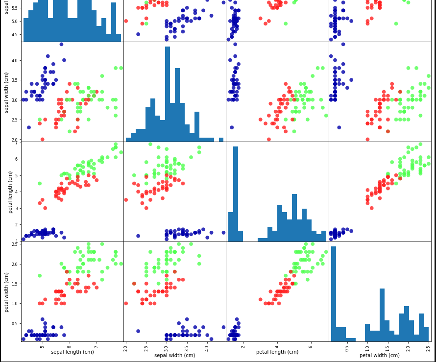
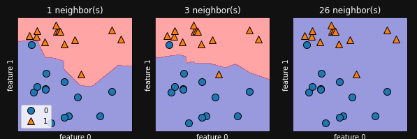
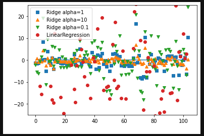
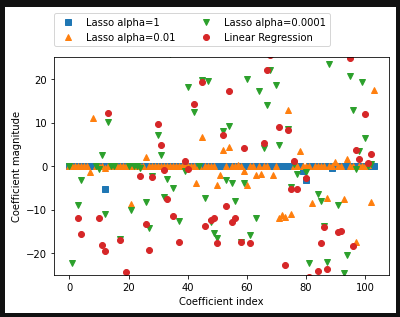
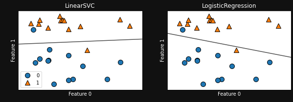
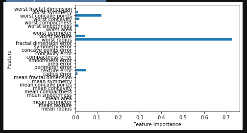
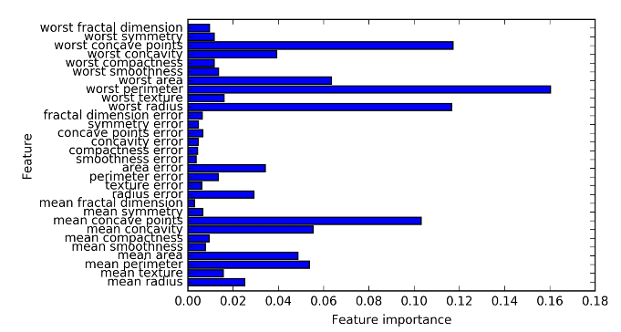
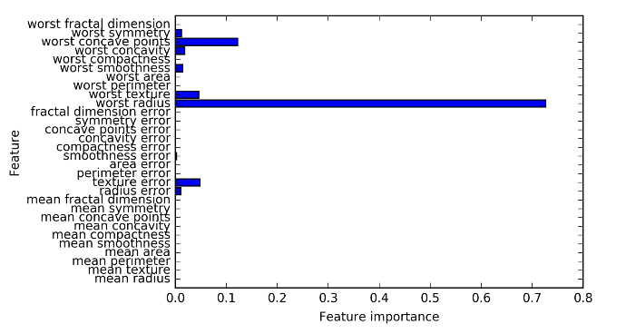

# K-Nearest Neighbor (KNN) Topics
Split data into a training set and a validation set.
The following example does 25% validation and 75% training.
```python
X_train, X_test, y_train, y_test = train_test_split(iris_dataset['data'], iris_dataset['target'], random_state=0)
```

Scatter matrix looks at all possible pairs of features (pair plot).
The diagonal shows the histogram of each feature.
A pair plot is useful for when you have a small number of features
such as the four in the following example.
```python
import pandas as pd
pd.plotting.scatter_matrix(iris_df, c=y_train, figsize=(15,15), marker='o', hist_kwds={'bins':20}, s=60, alpha=.8, cmap=cm3)
```



k-nearest neighbors classifier -> to make a prediction for a new data point,
the algorithm finds the point in the training set that is closest to the new point.
Then it assigns the label of this training point to the new data point. The (k) refers
to instead of using the closest neighbor to the new data point (k=1) we can
consider any fixed number k of neighbors in the training. Then a prediction is made
based on the majority class among these neighbors.

```python
from sklearn.neighbors import KNeighborsClassifier

knn = KNeighborsClassifier(n_neighbors=1)
knn.fit(X_train, y_train)
```

Now predictions can be made on the above knn model.
Note: sckit-learn expects 2-dim arrays for the data.

```python
X_new = np.array([[5, 2.9, 1, 0.2]])
prediction = knn.predict(X_new)
print("Prediction:", prediction) # Prediction: [0]
print("Predicted target name:", iris_dataset['target_names'][prediction]) # Predicted target name: ['setosa']
```

Evaluating the model:
Can measure the accuracy of the model ergo the fraction of flowers
for which the right species was predicted.
Below has a test accuracy of 97% which means the model to be correct
97% of the time for new irises.

```python
y_pred = knn.predict(X_test)
print("Test score: {:.2f}".format(np.mean(y_pred == y_test))) # Test score: 0.97
# Can also use the score method of the knn object which computes the test set accuracy also.
print("Test score: {:.2f}".format(knn.score(X_test, y_test))) # Test score: 0.97
```

From output with neighbors=1 the decision boundary follows the data closely. 
Whereas more neighbors corresponds to a smoother decision boundary ergo
simpler model. The third with 26 nieghbors which is the size of the dataset
shows that the group with the higher number of data points closer "wins" over
the other (in this case blue wins).

```python
X, y = make_forge()
X_train, X_test, y_train, y_test = train_test_split(X, y, random_state=0)
clf = KNeighborsClassifier(n_neighbors=3)
clf.fit(X_train, y_train)
print("Test set predictions:", clf.predict(X_test)) # Test set predictions: [1 0 1 0 1 0 0]
print("Test set accuracy:{:.2f}".format(clf.score(X_test, y_test))) # Test set accuracy:0.86

fig, axes = plt.subplots(1,3,figsize=(10,3))

for n_neighbors, ax in zip([1,3,26], axes):
    clf = KNeighborsClassifier(n_neighbors=n_neighbors).fit(X,y)
    plot_2d_separator(clf, X, fill=True, eps=0.5, ax=ax, alpha=0.4)
    discrete_scatter(X[:, 0], X[:, 1], y, ax=ax)
    ax.set_title("{} neighbor(s)".format(n_neighbors), color='white')
    ax.set_xlabel("feature 0", color='white')
    ax.set_ylabel("feature 1", color='white')

axes[0].legend(loc=3)
```



Noting from the graph with one neighbor the model is more complex and the
training accuracy is perfect and the test accuracy is low ergo overfitting.
Though when more neighbors are added the model becomes simpler and
the training accuracy drops but the test accuracy is higher than
having one neighbor. We can see that around 6 neighbors performs the best.

```python
cancer = load_breast_cancer()
X_train, X_test, y_train, y_test = train_test_split(cancer.data, cancer.target, stratify=cancer.target, random_state=66)

training_accuracy = []
test_accuracy = []
neighbors_settings = range(1,11) # neighbors 1 to 10

for n_neighbors in neighbors_settings:
    clf = KNeighborsClassifier(n_neighbors=n_neighbors)
    clf.fit(X_train, y_train)
    training_accuracy.append(clf.score(X_train, y_train))
    test_accuracy.append(clf.score(X_test, y_test))

plt.plot(neighbors_settings, training_accuracy, label="training accuracy")
plt.plot(neighbors_settings, test_accuracy, label="test accuracy")
plt.ylabel("Accuracy")
plt.xlabel("n_neighbors")
plt.legend()
```


When using multiple nearest neighbors for knn regression the prediction is the mean of the relevant neighbors.
Regressors returns the R2 score - a measure of goodness of a prediction for a regression model.
A R2 = 0 corresponds to a constant model that just predicts the mean of the training set y_train.
Knn is not often used in practice because prediction can be slow and it cannot handle many features.

```python
X, y = make_wave(n_samples=40)
X_train, X_test, y_train, y_test = train_test_split(X, y, random_state=0)
reg = KNeighborsRegressor(n_neighbors=3)
reg.fit(X_train, y_train)

print("Test set prediction:", reg.predict(X_test)) # Numpy array
print("Test set R^2 {:.2f}".format(reg.score(X_test, y_test))) # Test set R^2 0.83
```

Notes:
Generalization, Overfitting, and Underfitting.
Model Generalizes well if model is able to make accurate predictions on unseen data.

A model that is too complex for the amount of info given is called overfitting.
Recall: the buying a boat example and making a complex rule based only on the training set.
Overfitting occurs when the model works well on the training set but is not able to generalize to new data.

If model is too simple example (Everybody who owns a house buys a boat) then you will not capture
the variability of the data and the model will perform poorly even on the training set which is called underfitting.

The larger variety of data points your dataset contains, the more complex a model you can use without overfitting.
Note duplicating the same data points or collecting very similar data will not help prevent overfitting.

Note when n_neighbors=1 the knn only considers the closest training data point to the point we want
to make a prediction for.

# Linear Topics
For Linear regression if you have more features than training data
any target can be perfectly modeled on the training set as a linear function.

Ordinary Least Squares -> finds params w and b that minimize the mean squared error between predictions and the true
regression targets (y) on the training set.

Mean Squared Error -> sum of squared differences between the predictions and the true values, divided
by the number of samples.

Note Linear regression has no parameters  which prevents control of model complexity.

Since the R2 values below are close together we are underfitting on the wave dataset.
Since the dataset is one dimensional the model is very simple (ergo restricted).
With a higher dimension dataset (more features) there is a higher chance of
a linear model overfitting.

```python
X, y = make_wave(n_samples=60)
X_train, X_test, y_train, y_test = train_test_split(X, y, random_state=42)
lr = LinearRegression().fit(X_train, y_train)
print("Training set score: {:.2f}".format(lr.score(X_train, y_train))) # Training set score: 0.67
print("Test set score: {:.2f}".format(lr.score(X_test, y_test))) # Test set score: 0.66
```

The Boston dataset has a higher chance of overfitting with linear regression
since there are many features and few data points. As we can see with
the R2 score of the training and test sets we are overfitting. Since we
have an issue with overfitting we need to utilize a model that allows us
to control the complexity of the model.

```python
X, y = load_extended_boston()
X_train, X_test, y_train, y_test = train_test_split(X, y, random_state=0)
lr = LinearRegression().fit(X_train, y_train)
print("Training set score: {:.2f}".format(lr.score(X_train, y_train))) # Training set score: 0.95
print("Test set score: {:.2f}".format(lr.score(X_test, y_test))) # Test set score: 0.61
```

Ridge Regression - allows us to control the complexity of the model and
uses the same formula as Ordinary Least Squares. The coefficients (w) have
an added constraint where we want the magnitude of the coefficients to be as
small as possible ergo all entries of w should be close to zero. The previous
mentioned statement is called regularization (ergo restricting a model
to avoid overfitting) and ridge regression uses L2 regularization.
Note a less complex model means worse performance on the training
set, but better generalization.

```python
ridge = Ridge().fit(X_train, y_train)
print("Training set score: {:.2f}".format(ridge.score(X_train, y_train))) # Training set score: 0.89
print("Test set score: {:.2f}".format(ridge.score(X_test, y_test))) # Test set score: 0.75
```

The alpha parameter in Ridge allows you to adjust how complex the model
becomes ergo how well it performs on the training set vs test set. The
default value is alpha=1.0 an alpha close to 0 performs similar to
Ordinary Least Squares whereas a larger alpha helps to restrict the model
potentially providing better generalization.

```python
ridge10 = Ridge(alpha=10).fit(X_train, y_train)
print("Training set score: {:.2f}".format(ridge10.score(X_train, y_train))) # Training set score: 0.79
print("Test set score: {:.2f}".format(ridge10.score(X_test, y_test))) # Test set score: 0.64
```

Note below is close to Ordinary Least Squares

```python
ridge01 = Ridge(alpha=0.1).fit(X_train, y_train)
print("Training set score: {:.2f}".format(ridge01.score(X_train, y_train))) # Training set score: 0.93
print("Test set score: {:.2f}".format(ridge01.score(X_test, y_test))) # Test set score: 0.77
```

Inspecting the coefficients of the three above models with different alphas
we can see how the coefficients get restricted based on alpha. We can
see for alpha=10 (more restricted) the coefficient are between -3 and 3.
And for linear regression where alpha=0 the coefficients are very large.
Note with less training data regularizatoin becomes less important.

```python
plt.plot(ridge.coef_, 's', label="Ridge alpha=1")
plt.plot(ridge10.coef_, '^', label="Ridge alpha=10")
plt.plot(ridge01.coef_, 'v', label="Ridge alpha=0.1")

plt.plot(lr.coef_, 'o', label="LinearRegression")
plt.xlabel("Coefficient index", color="white")
plt.ylabel("Coefficient magnitude", color="white")
plt.hlines(0, 0, len(lr.coef_))
plt.ylim(-25, 25)
plt.legend()
```



Lasso -> Uses L1 regularization where some coefficients are set to exactly zero ignoring certain features.
The lasso001 created a more complex model and ended up using only 33 of the 104 features which potentially
makes the model easier to interpret. Ridge Regression is usually used over Lasso but if have a large number
of features and expect only a few to be important, Lasso might be a better choice.

```python
X, y = load_extended_boston()
X_train, X_test, y_train, y_test = train_test_split(X, y, random_state=0)
lr = LinearRegression().fit(X_train, y_train)
print("Training set score: {:.2f}".format(lr.score(X_train, y_train)))
print("Test set score: {:.2f}".format(lr.score(X_test, y_test)))
# Below lasso with default params performs poorly because only accounting for 4 features.
lasso = Lasso().fit(X_train, y_train)
print("Training set score: {:.2f}".format(lasso.score(X_train, y_train)))
print("Test set score: {:.2f}".format(lasso.score(X_test, y_test)))
print("Number of features used:", np.sum(lasso.coef_ != 0))
# To reduce above underfitting we reduce alpha and increase max_iter.
lasso001 = Lasso(alpha=0.01, max_iter=100000).fit(X_train, y_train)
print("Training set score: {:.2f}".format(lasso001.score(X_train, y_train)))
print("Test set score: {:.2f}".format(lasso001.score(X_test, y_test)))
print("Number of features used:", np.sum(lasso001.coef_ != 0))
lasso00001 = Lasso(alpha=0.0001, max_iter=100000).fit(X_train, y_train)
print("Training set score: {:.2f}".format(lasso00001.score(X_train, y_train)))
print("Test set score: {:.2f}".format(lasso00001.score(X_test, y_test)))
print("Number of features used:", np.sum(lasso00001.coef_ != 0))
# Plotting the coefficients of the different models.
# For alpha=1 we see most of the coefficients are zero
# and remaining are small in magnitude.
plt.plot(lasso.coef_, 's', label="Lasso alpha=1")
plt.plot(lasso001.coef_, '^', label="Lasso alpha=0.01")
plt.plot(lasso00001.coef_, 'v', label="Lasso alpha=0.0001")
plt.plot(lr.coef_, 'o', label="Linear Regression")
plt.legend(ncol=2, loc=(0, 1.05))
plt.ylim(-25, 25)
plt.xlabel("Coefficient index")
plt.ylabel("Coefficient magnitude")
```

Output:
Training set score: 0.95
Test set score: 0.61
Training set score: 0.29
Test set score: 0.21
Number of features used: 4
Training set score: 0.90
Test set score: 0.77
Number of features used: 33
Training set score: 0.95
Test set score: 0.64
Number of features used: 96



Linear Models for Classification -> If Linear function is smaller than zero we predict the class -1
and if it is larger than zero we predict the class +1.

For LinearSVC and LogisticRegression the param that deters the strength of the regularization
is C, the higher value of C corresponds to less regularization. When have a high value of C
the above models try to fit the data as best as possible and when C is close to zero the model
tries to find coefficients that are close to zero.

NOTE: Using a low C causes model to adjust to the majority of data points
whereas a high C stresses the importance that each individual data point
be classified correctly.

```python
X, y = make_forge()
fig, axes = plt.subplots(1,2,figsize=(10,3))
for model, ax in zip([LinearSVC(), LogisticRegression()], axes):
    clf = model.fit(X, y)
    plot_2d_separator(clf, X, fill=False, eps=0.5, ax=ax, alpha=0.7)
    discrete_scatter(X[:, 0], X[:, 1], y, ax=ax)
    ax.set_title(clf.__class__.__name__, color='white')
    ax.set_xlabel("Feature 0", color='white')
    ax.set_ylabel("Feature 1", color='white')
axes[0].legend()
```

Output:


Linear Models with Multiclass classification -> Having one binary classifier per class
results in one vecotr of coefficients and one intercept for each class.

NOTE: If your data consists of hundreds of thousands or millions of samples
maybe investigate solver='sag' in LogisticRegression and Ridge which can be faster
than default on large datasets.

# Naive Bayes Classifiers
Naive Bayes Classifiers -> Similar to linear models but faster in training but tend to provide less optimal
generalization than classifiers like LogisticRegression or LinearSVC. Are often used on very large
datasets where training even a linear model might take too long. Checkout GaussianNB, BernoulliNB, and
MultinomialNB in sckitlearn.

# Trees
Decision Trees -> learn a hierarchy of if/else questions, leading to a decision.
Can easily overfit data. To prevent this potential overfitting can
stop creation of tree early called pruning or building tree and then
removing nodes that do not contain much info. Pre-pruning can be done
by limiting the max depth of the tree or max number of leaves.

The tree was grown deep enough so that it perfectly memorized all the labels on
the training data. Pre-pruning the tree allows the test set to improve
thus our model is now generalizing better.

Feature importances -> From the below tree we can see that worst radius holds
the most importance.

```python
cancer = load_breast_cancer()
X_train, X_test, y_train, y_test = train_test_split(cancer.data, cancer.target, stratify=cancer.target, random_state=42)
tree = DecisionTreeClassifier(random_state=0)
tree.fit(X_train, y_train)
print("Accuracy on training set:{:.3f}".format(tree.score(X_train, y_train)))
print("Accuracy on test set:{:.3f}".format(tree.score(X_test, y_test)))
tree = DecisionTreeClassifier(max_depth=4, random_state=0)
tree.fit(X_train, y_train)
print("Accuracy on training set:{:.3f}".format(tree.score(X_train, y_train)))
print("Accuracy on test set:{:.3f}".format(tree.score(X_test, y_test)))
plot_feature_importances_cancer(tree, cancer)
```

Output:
Accuracy on training set:1.000
Accuracy on test set:0.937
Accuracy on training set:0.988
Accuracy on test set:0.951



# Ensembles of Decision Trees

## Random Forests:
A collection of decision trees to help reduce overfitting. And each tree is slightly different than the others.
We average the results of all the varying decision trees that have a high chance of overfitting.

To build a random forest you set the number of estimators and a bootstrap sample of our data is taken ergo
from our n samples data points, we repeatedly draw an example randomly with replacement n samples times.
The max_features parameter causes a selection of a subset of features to be taken on each node of a tree so
each node in a tree can make a decision using a different subset of features. If max_features is set to the
number of features in the dataset ergo each split considers all features than no randomness will be injected
in the feature selection. A low max_features means that the trees will be quite different and each tree
might need to be very deep in order to fit the data well. For prediction the probs predicted by all the trees
are averaged and the class with the highest prob is predicted.

The added randomness of the forest allows it to capture a broader idea of the data compared to a single tree.
We can see from the below images that the forest captures a more reliable idea of each
features importance.

### Random Forest Feature Importance


### Decision Tree Feature Importance


### Keypoints an Random Forests
- They can be parallelized on multiple CPUs.
- Require more memory and slower to train and perdict than linear models.

# Gradient boosted regression trees
- Combines multiple decision trees
- Each tree tries to correct the mistakes of the previous
- Do not use randomizatoin and focus on using pre-pruning and have very shallow trees ergo depth one to five
- Learning-rate is used to dictate how strongly each tree tries to correct mistakes of the previous
- A high learning-rate means the next tree makes stronger corrections leading to a more complex model
- Adding more estimators also adds to the model complexity