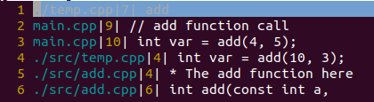

# Custom Multiline Search in Vim

## Objective
Figure out how to multiline search a code base in a fast manor and avoid \
using vim tags. In the past have been using `grep` but this tool only \
searches single lines.

## Compatibilty
The function `bufload` used in my vim script is vim 8 specific. The following
is my implementatin in [vim 7](#vim-7-version). 

## Table of Contents
- [Code Solution](#solution)
- [Code Explanation](#explanation)
- [mksession](#fun-command)
- [Vim Cheatsheet](#vim-keyboard-cheat-sheet)
- [vimrc without plugins](#vimrc-file-without-plugins)

## Solution
### Vim tree structure
```shell
~/.vim
├── after
│   └── ftplugin
│       ├── cpp.vim
│       ├── cu.vim
│       └── c.vim
├── autoload
│   └── ft
│       └── calter.vim
├── sessions
│   └── mys.vim
└── vimrc
```

### Below code in: calter.vim
```vim
" Find a function definition for C/Cpp/Cu
function! ft#calter#Cdef_(funcName)

    exe 'silent grep! -r --include="*.c" --include="*.cpp" ' .
       \ '--include="*.cu" ' . a:funcName . ' .' | redraw!
    
    let qfLst = getqflist()
    for qfl in qfLst
        let fpath = bufname(qfl.bufnr)
        let _ = bufload(fpath)
        
        let lineEOF = getbufline(fpath, '$')[0]
        let lineNum = qfl.lnum
        let lineStr = getbufline(fpath, lineNum)[0]
        let matches = match(lineStr, '[/{;]')
        while matches == -1
            if lineEOF == lineStr
                break
            endif

            let lineNum += 1
            let lineStr = getbufline(fpath, lineNum)[0]
            let matches = match(lineStr, '[/{;]')
        endwhile
        
        if match(lineStr, '{') != -1
            exe 'tabnew +' . qfl.lnum . ' ' . fpath
            echo "File Found at " . qfl.lnum
            return
        endif
    endfor

    echo "File Not Found"
    return

endfunction
```

### Below code in: c.vim
```vim
setlocal path=$PWD/**/*src/**,$PWD/**/*inc*/**
setlocal wildignore=*.o,*.d,*.exe,*.a,*.so,*.out

command! -nargs=1 Cdef call ft#calter#Cdef_(<f-args>)
```

### Below code in: cpp.vim and cu.vim where $RTP is my runtime path
```vim
runtime $RTP/after/ftplugin/c.vim
```

## Explanation
### Important Details
- calter.vim is in the autoload folder because it should only load when \
the function is called.
- If calter.vim was placed in the c.vim file you would get an error \
since the function would load when another c/cpp/cu file opens from \
the function to find a defintion.
- The command defined in c.vim `Cdef` can only be called when you are in \
a c/cpp/cu file. If you wanted any file you would place this command \
in your vimrc file.
- The command in c.vim uses the path to the calter.vim file from autoload ergo:
    - ft#calter#Cdef\_

### Run Command in c.vim
- To run the command in vim:
    - :Cdef \<function name\>

### Code Explained
```vim
exe 'silent grep! -r --include="*.c" --include="*.cpp" ' .
    \ '--include="*.cu" ' . a:funcName . ' .' | redraw!
```
Fills the quickfixlist with the files that contain the function name. \
An example looking for the function name 'add' is shown below:



Each of the rows in the image can be grabbed as a dictionary. \
And the items can be accessed as documented here:
- <a href="https://vimhelp.org/builtin.txt.html#getqflist%28%29"
  target="_blank">Vim getqflist</a>

```vim
let qfLst = getqflist()
for qfl in qfLst
" ... more code here ...
endfor
```
Iterates over each item in the quickfixlist as a dictionary.

```vim
let fpath = bufname(qfl.bufnr)
let _ = bufload(fpath)
```
Grabs the file path and then loads the buffer if it is not already loaded. \
Note we do not care about what bufload returns. We need to load each buffer \
locally to the function so that we can parse the files.

```vim
let lineEOF = getbufline(fpath, '$')[0]
let lineNum = qfl.lnum
let lineStr = getbufline(fpath, lineNum)[0]
let matches = match(lineStr, '[/{;]')
while matches == -1
    if lineEOF == lineStr
        break
    endif

    let lineNum += 1
    let lineStr = getbufline(fpath, lineNum)[0]
    let matches = match(lineStr, '[/{;]')
endwhile
```
First grabs the last line and then the line starting at the function name in \
the corresponding buffer which is done by `getbufline`. Next we use regex to \
see if this line contains: '/'=comment, '{'=function definition, or \
';'=function call. Finally we repeat the above steps till we find one of the \
three above symbols in a given line from each buffer. Or if the line is the \
end of the file we break from the while loop.

```vim
if match(lineStr, '{') != -1
    exe 'tabnew +' . qfl.lnum . ' ' . fpath
    echo "File Found at " . qfl.lnum
    return
endif
```
If the line in the buffer contains a '{' we have found a function definition \
and we open this buffer in a new tab at the specific line number (qfl.lnum) \
of the function name. And if we have not found a '{' we go to the next \
buffer in the quickfixlist. And that's all folks!

## Fun command
If working on a server you can use :mksession \<file.vim\> to save all \
the tabs and settings you have.

## Vim Keyboard Cheat Sheet
- <a href="../docs/vim_sheet.pdf"
  target="_blank">Vim Cheat Sheet</a>

## vimrc file without plugins
```vim
set backspace=indent,eol,start
set hidden
set noswapfile
set shiftwidth=4 tabstop=4 softtabstop=4 expandtab
set autoindent smartindent smartcase
set encoding=utf-8
set hls
set wildmenu
set wildmode=list:longest,full
set number
set path=$PWD/**
set colorcolumn=80
set showcmd

filetype detect
filetype plugin indent on

syntax on
colorscheme desert
set t_Co=256

let $RTP=split(&runtimepath,',')[0]
let $RC="$HOME/.vim/vimrc"
let $MYS="$HOME/.vim/sessions/mys.vim"

" Remove highlight after search
nnoremap <silent> <c-\> :nohls<cr><c-\>

" Force use of hjkl-style movement and up(c-b)/down(c-f)
map <up> <nop>
map <down> <nop>
map <left> <nop>
map <right> <nop>
map <pageup> <nop>
map <pagedown> <nop>

" Command line mode without shift+:
noremap ; :

" Faster split window navigation
noremap <c-h> <c-w><c-h>
noremap <c-j> <c-w><c-j>
noremap <c-k> <c-w><c-k>
noremap <c-l> <c-w><c-l>

function Grep_(exts, pattern)
    exe 'silent grep! -r ' a:exts . ' ' . a:pattern .
        \ ' .' | tabnew | copen 42 | redraw!
endfunction

command! -nargs=* Cgrep call Grep_('--include="*.c*"', <f-args>)

" Close buffer without closing window
command! Bd :bp | :sp | :bn | :bd
```
## Vim 7 Version
```vim
" Find a function definition for C/Cpp/Cu
function! ft#calter#Cdef_(funcName)

    exe 'silent grep! -r --include="*.c" --include="*.cpp" ' .
       \ '--include="*.cu" ' . a:funcName . ' .' | redraw!
    
    let qfLst = getqflist()
    for qfl in qfLst
        let fpath = bufname(qfl.bufnr)
        let isLoaded = bufloaded(fpath)
        if isLoaded == 0
            exe 'tabnew ' . fpath
        endif
        
        let lineEOF = getbufline(fpath, '$')[0]
        let lineNum = qfl.lnum
        let lineStr = getbufline(fpath, lineNum)[0]
        let matches = match(lineStr, '[/{;]')
        while matches == -1
            if lineEOF == lineStr
                break
            endif

            let lineNum += 1
            let lineStr = getbufline(fpath, lineNum)[0]
            let matches = match(lineStr, '[/{;]')
        endwhile

        if isLoaded == 0
            exe 'bdelete ' . fpath
        endif
        
        if match(lineStr, '{') != -1
            exe 'tabnew +' . qfl.lnum . ' ' . fpath
            echo "File Found at " . qfl.lnum
            return
        endif
    endfor

    echo "File Not Found"
    return

endfunction
```

